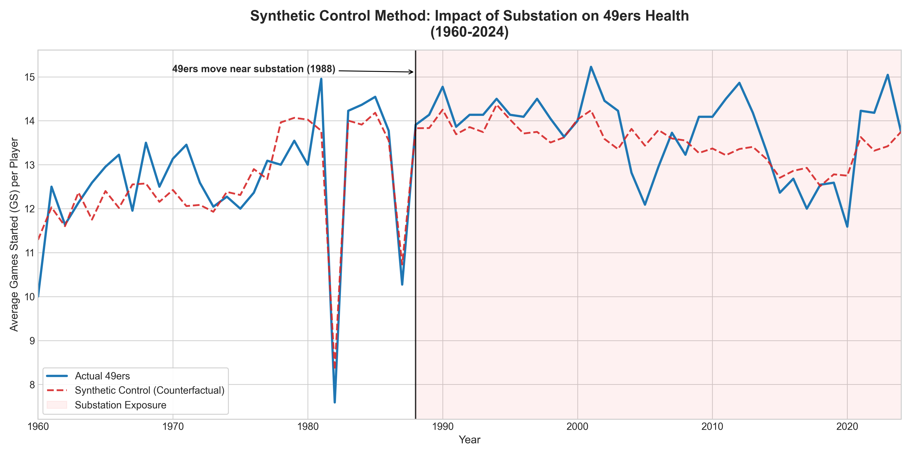

# Are Electromagnetic Fields (EMF) to blame for the San Francisco 49ers' recent spike in injuries?
>Eric Gutiérrez, 19th January 2026.

### The Story
In recent weeks, a theory has been circulating online that blames Electromagnetic Fields (EMF) for the high number of injuries on the San Francisco 49ers this season. To further ascertain the validity of these claims, we use a Synthetic Control Method (SCM) to build a synthetic counterfactual for the 49ers as a weighted combination of all other 31 teams in the NFL. We then compare the average player's health on the team against the counterfactual.

### Data & Methods
We use the average games started* (GS) per player in a season as a measure of a given team's players' health, and as the variable to follow when comparing the 49ers and their synthetic counterfactual. In order to build the counterfactual from other teams, a series of team stats have been taken into account, specifically:

| Team Stats* |  |
|----------|----------|
| - Points Scored | - Rushing Attempts |
| - Yards | - Rushing Yards Gained |
| - Offensive Plays | - Rushing Touchdowns |
| - Yards per Offensive Play | - Rushing Yards per Attempt |
| - Turnovers Lost | - First Downs by Rushing |
| - Fumbles Lost | - Penalties Committed and Accepted |
| - First Downs | - Penalties in Yards Committed |
| - Passes Completed | - First Downs by Penalty |
| - Passes Attempted | - Yards Gained by Passing |
| - Passing Touchdowns | - Interceptions Thrown |
| - Net Yards Gained per Pass Attempt | - First Downs by Passing |

\* All the data comes from _pro-football-reference.com_.

The synthetic San Francisco 49ers is made up of the following NFL teams:
- Los Angeles Chargers (35.04%)
- Arizona Cardinals (21.80%)
- Las Vegas Raiders (15.04%)
- Indianapolis Colts (11.53%)
- Los Angeles Rams (8.07%)
- Denver Broncos (4.51%)
- Buffalo Bills (3.99%)
- Others (<1%)

### Results
Prior to 1988, the synthetic counterfactual tracks the trends of the actual team satisfactorily, even though a perfect or near-perfect fit is not achieved. From 1988 onwards, if the EMF were to blame for an increase in injuries, we would observe a gap widening between the treatment and control units. The latter would be consistently above the former, which is not the case, as demonstrated in Figure 1. In fact, during the first decade after the 49ers moved to the new facility near the substation, the actual health of the team was higher than predicted.

|  |
|:--:| 
| *Fig 1. Synthetic Control Method results. Average games started per player for both the treatment and control (counterfactual) units (1960-2024).* |

Moreover, and if we turn now to the Average Treatment Effect (ATE) between 1989 and 2024, we see that the effect of moving to the new location was positive. Specifically, the move caused a 0.11 increase in average games started per player. That is, on average, the change in location was responsible for 0.11 additional average games started per player during this period. This is not to suggest that the substation _increased_ player health _per se_, but rather that the change of location did.

### Conclusions
Electromagnetic fields (EMF) are not to blame for the recent spike in injuries in the San Francisco 49ers this 2025 season, which aligns with the intuition that if the Silicon Valley Power's Northern Receiving Station were affecting the players' health, the symptoms would have started right after or a few seasons after the move, which is not the case.

However, one could argue that the change in location reported notable increases in player health, which in turn would be partially offset by the negative effects of being near to the substation. New facilities might be better equipped to handle health-related endeavors, for example. We are inclined to believe that the value of this improvement, however, is not significant enough to contradict the results presented here.